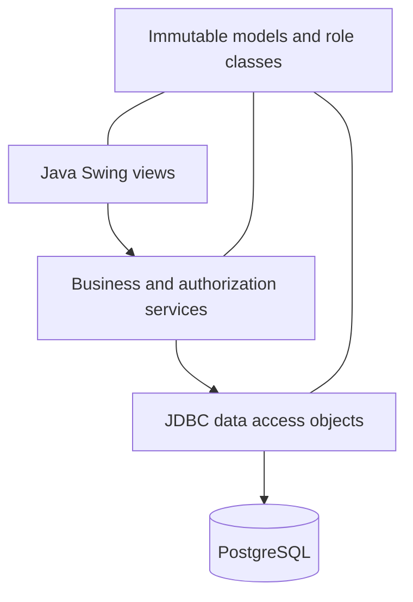
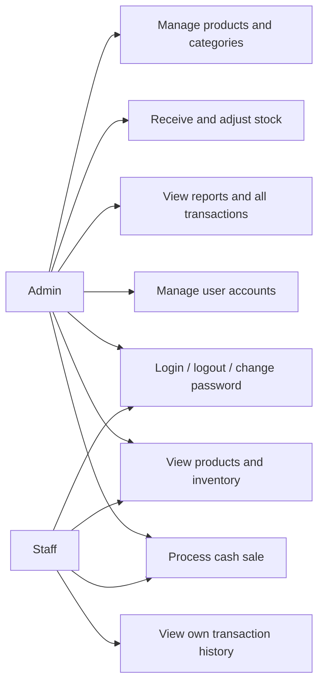
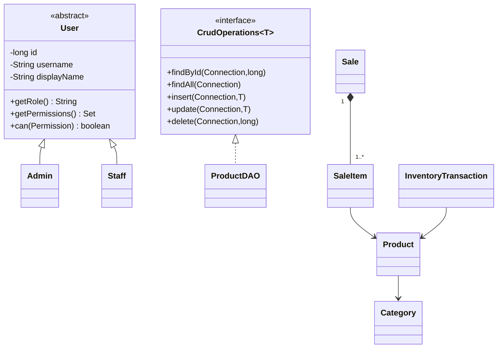
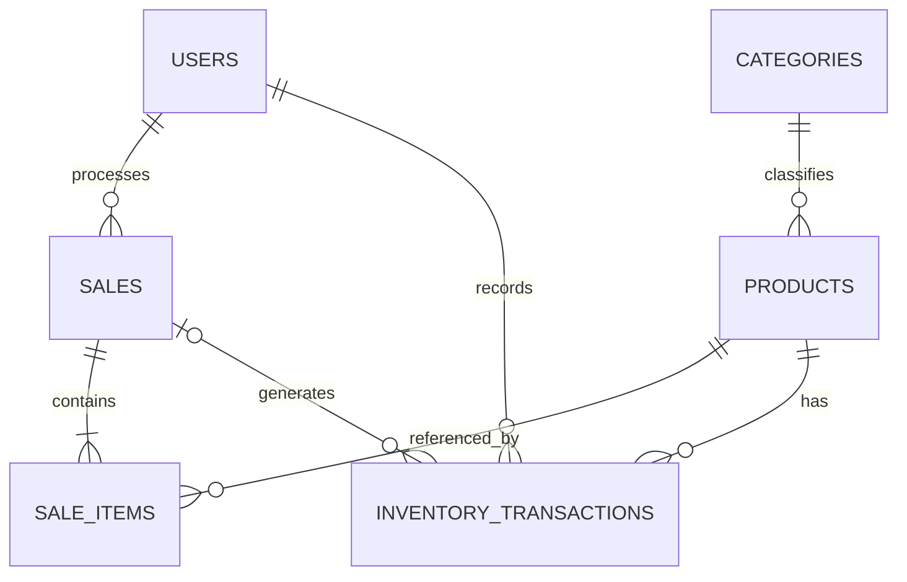
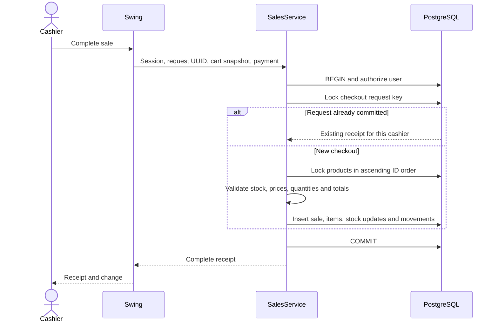

# Project design and demonstration notes

## Purpose and scope

The application demonstrates Java language fundamentals, object-oriented design, Swing events, JDBC, prepared statements, database relationships, input validation and exception handling in one practical desktop system.

It follows the supplied Programming (Java) NC III project brief. This document maps the implementation to the brief; it does not claim independent certification or verify current TESDA curriculum hours.

No Spring Boot, React, Node.js, Docker, microservices, or cloud backend is used in the Stockroom application. The separate pre-existing Spring starter folder is not part of this Maven project.

## Architecture

Swing views collect input and display results. Services enforce business rules and permissions. DAOs execute parameterized JDBC queries. PostgreSQL stores all persistent records.

- **model:** immutable data objects, permissions, abstract User and concrete Admin/Staff subclasses.
- **view:** frames, panels, dialogs, event handling, visual formatting and background workers.
- **service:** authentication, authorization, validation, products, inventory, checkout, reporting.
- **dao:** prepared SQL and result mapping. Services own transaction boundaries.
- **database:** connection creation, SQL error translation and initial schema setup.
- **config:** local file and environment-variable configuration.
- **util:** currency/date formatting, receipt formatting, CSV encoding.

## Use cases

Admin can authenticate, manage products and categories, receive and adjust stock, create sales, view all transactions, generate reports, manage users, change passwords and sign out.

Staff can authenticate, view/search/filter products, view inventory and movements, process sales, view their own transactions, change their password and sign out.

Authorization exists in services in addition to the menu. Hiding a button is never the only protection.

### Scenario: successful cash sale

Preconditions: the user is active and signed in; the selected products are active and available.

The cashier adds products, sets quantities, and enters payment. The system validates the cart, authorizes the user, locks products in ID order, checks current stock and prices, calculates exact monetary totals, saves the sale and lines, reduces inventory, records stock movements, commits and displays the receipt.

Postconditions: one receipt exists, payment covers total, change is exact, inventory never becomes negative, and every deduction is traceable.

Alternatives: empty cart, invalid quantity, insufficient payment, insufficient stock, changed price, archived product, expired session, or database failure produce a clear error. A failure rolls back all writes.

### Scenario: receive stock

An admin selects a product, enters a positive number and a reference. The service locks the product, adds the quantity, checks the resulting bounds, saves the stock and records before/after quantities atomically.

### Scenario: correct a stock count

An admin supplies the new counted quantity and reason. The form includes the quantity originally seen. The service rejects the operation if that original quantity is stale, preventing a count entered before a sale from silently overwriting the sale.

### Scenario: archive a product

An admin selects a product with zero stock and confirms. The product is marked inactive. Historical sale lines and stock movements remain queryable.

## Class relationships and OOP

Encapsulation appears in User's private final fields and getters. Records encapsulate immutable product, category, cart, receipt and movement values. Inheritance and abstraction appear in the sealed abstract User hierarchy. Polymorphism appears when the same can(permission) call resolves to the permissions of Admin or Staff. CrudOperations<T> demonstrates a generic interface implemented by ProductDAO.

The cart uses LinkedHashMap and snapshots as Lists to combine duplicate products while preserving insertion order. Other operations use ArrayList, Set, loops, stream pipelines, conditionals, switch expressions, constructors, methods and exceptions.

Money uses BigDecimal instead of double to avoid binary floating-point rounding errors. Quantities are integers; totals and report unit counts use long where appropriate.

## Database relationships

There are six application tables.

**users** holds username, display name, salted password hash, role, activation, session version, and creation date. **categories** holds unique names. **products** holds category, price, current quantity, minimum stock, activation, optimistic version, and timestamps.

**sales** holds cashier, unique checkout request UUID, total, payment, change and timestamp. **sale_items** holds product ID plus a historical name and price snapshot, quantity and subtotal. **inventory_transactions** holds signed changes, previous/new stock, user, optional sale, reason and timestamp.

Foreign keys preserve references. Unique indexes enforce case-insensitive names. Check constraints protect numeric ranges and calculation relationships. Timestamps use TIMESTAMPTZ; date-range queries explicitly convert local business-day boundaries into instants.

The initial schema is in src/main/resources/database/schema.sql. It is idempotent for new deployments and serialized with an advisory lock. Future structural upgrades need explicit reviewed migrations; the application does not silently drop and recreate tables.

## Checkout sequence and concurrency

Row locks prevent two cashiers from selling the same final units. Consistent product lock ordering reduces deadlocks. A unique request key and transaction-scoped advisory lock protect retries and concurrent duplicate submissions. Optimistic versions prevent lost edits to product metadata.

Reports use a repeatable-read snapshot so summary, detail and inventory sections agree within one generated report. Staff scope is enforced before transaction data is returned.

## Security boundaries

Passwords are hashed with PBKDF2-HMAC-SHA256, 600,000 iterations, a random 16-byte salt and a 256-bit derived key. Comparison uses MessageDigest.isEqual. Password arrays captured by Swing workers are cleared after use. Login failures use a generic message and a bounded per-username delay policy.

Sessions are opaque random tokens kept in memory with an eight-hour lifetime. Every service operation verifies the active user in PostgreSQL. Password and account changes increment a database session version, invalidating stale sessions in other running instances.

Prepared statements carry all external SQL values. SQL identifiers constructed by the test harness are generated internally, pattern-checked and confined to explicitly named test databases.

The local setup account used by the application has no superuser, role-creation or database-creation permissions. It owns its application schema so it can initialize it. This is a trusted desktop application: a person with access to the machine and database configuration can bypass application roles. For a hostile multi-user network, introduce a server-side trust boundary and a separately controlled migration account.

Database secrets stay in ignored local files. PostgreSQL listens only on 127.0.0.1 with SCRAM authentication. Password resets are local operations and do not send email. No telemetry or cloud synchronization is included.

## Limits and future work

Cash-only sales; no discounts, returns, taxes, purchasing, cost accounting, barcode hardware integration, multi-branch synchronization or statutory invoicing. Sales and movement screens display the latest 500 rows, while summary reports aggregate the entire selected period. The catalog is loaded in memory for a small-store workflow. Backup scheduling is not automatic.

A future extension can add audited returns, purchase-order receiving, paging for large catalogs, explicit versioned database migrations and a tax-compliant invoicing module after jurisdiction-specific review.

## Suggested project demonstration

1. Explain the brief, roles and layered architecture.
2. Create an administrator and load the optional sample catalog.
3. Add a product and demonstrate duplicate-name and price validation.
4. Receive stock, correct a count, and show the movement history.
5. Search and filter products, including low and zero stock.
6. Build a cart, demonstrate insufficient payment and stock, then complete a valid sale.
7. Show exact change and saved receipt.
8. Show that inventory decreased and the corresponding movement was recorded.
9. Generate a daily report and export it.
10. Create a staff user and demonstrate the reduced menu and transaction scope.
11. Walk through Product, User/Admin/Staff, CrudOperations, a DAO prepared statement, and the checkout transaction.
12. Run the automated test suite and explain the concurrent-purchase and rollback tests.
